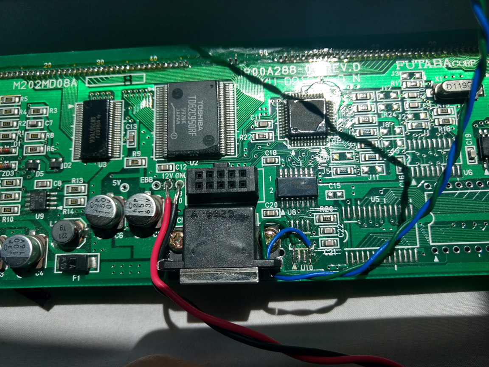

# Futaba M202MD08A driver for atmega328p
Simplified driver code for Arduino Pro Mini (atmega328p)
Bitbanged serial output, reception handled with an interrupt
Used in IBM 41K6814 20x2 dual VFD Point of Sale displays.
Supports both displays and some basic commands

## Connection and usage info

To avoid the need of an external RS485 to drive the display, I desoldered the A176b Integrated Circuit (U10 on the board) and soldered two wires (green and blue) to the pins 1 and 4. The one connected to pin 1 should go to VFD_RX (PD3 on the Arduino), while the one connected to pin 4 should go to VFD_TX (PD2 on
the Arduino). Also the Arduino ground and the display ground must be joined.

The usage is easy: Everything you send to the terminal gets sent to the display. Some debug messages are also sent to the user.

Also, I've only tested with an Arduino pro mini with a 16 MHz clock. The Arduino nano also has the same speed, so it should be fine. If a microcontroller with another speed is used, the F_CPU macro must be changed to the correct value.

Released under Public Domain (code provided "as is", without warranty of any kind)
2017 - Gzalo (Gonzalo Ávila Alterach)